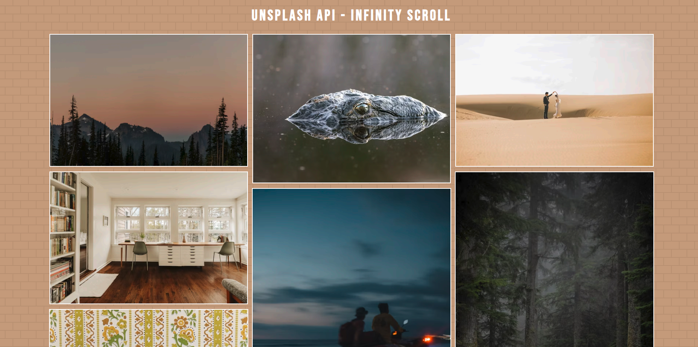

<div align="center">

# 🖼️ Infinity Scroll

    

Explore an endless gallery of random photos powered by the Unsplash API — built with vanilla JavaScript and infinite scroll.

</div>

## 📖 About

A responsive image mural built with vanilla JavaScript that fetches random photos from the Unsplash API. As the user scrolls toward the bottom of the page, new images are automatically loaded in batches, creating the sensation of an endless, ever-changing gallery.

## ✨ Features

- **Infinite scroll** — images are loaded in batches as the user approaches the end of the page
- **Random photos** — every session displays a unique set of images from Unsplash
- **Rate limit feedback** — displays a message with the exact reset time when the API hourly limit is reached
- **Optimized performance** — early API fetch, preconnect hints, and lazy loading for offscreen images

## 🎬 Demo



🔗 [Live demo](https://pmbfsa.github.io/infinity-scroll/)

## 🚀 Getting Started

### Prerequisites

- Node.js 18+
- An Unsplash API key — get one at [unsplash.com/developers](https://unsplash.com/developers)

### Installation

```bash
# Clone the repository
git clone https://github.com/pmbfsa/infinity-scroll.git
cd infinity-scroll

# Install dependencies
npm install
```

### Configuration

Create a `.env.local` file in the root with your Unsplash API key:

```env
VITE_UNSPLASH_KEY=your_access_key_here
```

> ⚠️ The free tier of the Unsplash API is limited to **50 requests per hour**. The app will display a message with the exact reset time when this limit is reached.

### Development

```bash
npm run dev
```

### Production Build

```bash
npm run build
```

The output is generated in the `/docs` folder for GitHub Pages deployment.

## 🛠️ Built With

| Technology                                                 | Purpose                                   |
| ---------------------------------------------------------- | ----------------------------------------- |
| HTML5                                                      | Page structure and semantics              |
| CSS3                                                       | Styling and responsive layout             |
| JavaScript (Vanilla)                                       | Infinite scroll logic and API integration |
| [Vite](https://vitejs.dev/)                                | Build tool and dev server                 |
| [Unsplash API](https://unsplash.com/developers)            | Random photo fetching                     |
| [Bebas Neue](https://fonts.google.com/specimen/Bebas+Neue) | Display typography                        |

## 📁 Project Structure

```
infinity-scroll/
├── docs/               # Production build (GitHub Pages)
├── public/
│   └── favicon.png
├── src/
│   ├── assets/
│   │   └── loader.svg
│   └── styles/
│       └── style.css
├── index.html
├── package.json
└── vite.config.js
```

## 📄 License

This project is licensed under the [GNU General Public License v3.0](https://www.gnu.org/licenses/gpl-3.0.en.html).
